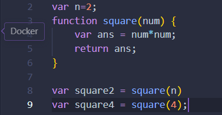
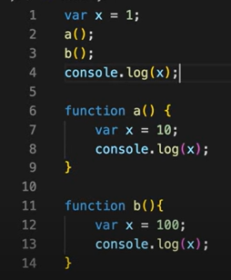
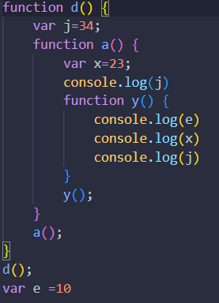
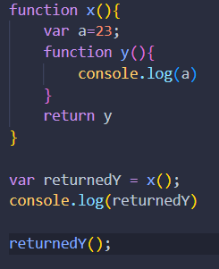

# This document covers JavaScript from beginner to advanced levels.

## JavaScript Introduction

<b> Definition: </b> 
- JavaScript is a scriptimg language. It is a high level, Object-oriented, multi-paradigm, programming language. 
- JavaScript is called multi-paradigm because the language is very dynamic in nature and it can solve problem using different programming styles such as OOP, procedural, functional etc.
- JavaScript is a loosely typed or dynamically typed language.
- `Everything in JavaScript happens inside an Execution context`.
- Execution context is like a big container it has two component:
    - Memory component: All the variable and functions are stored as key:value pair. This is also know as variable environment.
    - Code component: This is the place where code is executed one line at a time. This is also know as `Thread of Execution`.
- JavaScript is a `synchronous single threaded language`.
    - Single threaded means Javascript can execute one command at a time.
    - Synchronous single threaded means JavaScriot can execute only one command at a time and in a specific order, it means it can execute next line of code after completing the current execution.

<b> Role of JavaScript: </b>
- JavaScript is responsible for for adding dynamic and interactive effect in the webpages.
- JavaScript can be used on both client-side and server-side.
- On top of JavaScript many frameworks were built such as
    - <u>Frontend</u>: React JS, Next JS etc.,
    - <u>Backend</u>: Express JS, Node JS, Nest JS etc.,
    - <u>Mobile</u>: React-nativd etc.,
    - <u>Desktop</u>: ion etc.,

<b> History of JavaScript: </b>
- The first version of JavaScript was invented in the year 1995 by Brendan Eich and it was called Mocha.
- In 1996 Mocha changed to LiveScript and later changed to JavaScript.
- JavaScript has nothing to do with Java. It was named liked that just to attract Java Developers.
- With a need to standardize the language, ECMA releases ECMAScript (ES1), The first official JavaScript (ECMAScript is the standard, JavaScript the language in practice).
- In 2009 ES5 is released with lots of great new features.
- In 2015 ES6 was released and it was the biggest update to the language ever!

<b> How JavaScript code is executed and call stack: </b>
-  
- Let us understand the execution of simple JS programe behind the scene:
    - step1: When we run the programme A global execution context is created. The execution context is created in two phases `memory creation phase` and `code execution phase`.
    - JavaScript executes code line by line and stores the variable in `variable environment` and allocates the memory.
        - In case of variable undefined is assigned and in terms of function entire function is stored.
    - Again JavaScript runs through the code in the thread of execution. In this phase all the calculation and values are assigned.
        - In case of variable `undefined` value is replaced with the `actual value`.
        - In case of functions it skips and moves to the next line of code.
    - In JavaScript functions are the most important part of the JS. Here, functions are like mini programme and new execution context is created when they are invoked.
    - Whenever a function encounters `return`, It finds the value of the variable it is returning in the local memory and returns to the place wherever it is been invoked and replaces the value.
    - Once all this is completed it then moves the control to the next line of code.
    - If it encounters a function again it will create a new execution context.
    - As soon as the function execution is completed it deletes the execution context.
- Call stack: 
    - JavaScript manages everything like creation, deletion, allocation etc using stack known as call stack.
    - Whenever JavaScript program run the Global execution context(GEC) is pushed to the stack.
    - If JavaScriot encounters a function the newly created function execution context(FEC) is pushed on top of the GEC. Once the execution of the function is completed it pops the FEC and returns back to GEC and so on.
    - Callstack are only for managing the execution context.
    - Callstack maintains the `orders of execution` of the execution context. Callstack also known as:
        - execution context stack 
        - program stack
        - runtime stack etc.

<b> Hoisting in JavaScript </b>
    - Hoisting is concept of extracting variables and functions to the top of their scope before the initialization without getting any errors.
    - In JavaScript hoisting happens by default. It happens during the first phase of the execution context i.e., memory allocation phase.
    - Functions are fully hoisted allowing them to use before their actual definition.
    - Variables are hoisted but only the declaration and initialized with undefined.
    - let and const are hoisted only the declaration and uninitialized leading to tTemporal Dead Zone(TDZ). If tried to access before initialization throws `ReferenceError`.
    - Function expression and arrow functions are hoisted as variables so if we try to access before declaration it will throw `TypeError`.


## JavaScript Basics - Part 1

<b>Conventions for naming a Variable: </b>
- We need to follow camelcase for naming (ex: namingVariables).
- Variable name should not start with number or any special character.
- Variable name can only contain alphabets, numbers, underscore and dollar sign.
- Reserved keywords cannot be used to  name the variable.
- Const variable which do not change its value will be written with all uppercase letters.

<b>Data Types: </b>
- Everything in JavaScript is either object, array or primitive type.
- Since JavaScript has dynamic typing data types of the value declared are determined automatically.
- In JavaScript value has a type not the variable.
- Different types of datatypes are:
    - Number: JavaScript are always floating point numbers.
    - String: Sequence of characters.
    - Boolean: Logical type that can take only true or false.
    - undefined: Value taken by a variable that is not yet defined or Empty value.
    - Null: Also means empty value
    - Symbol (ES2015): Value that is unique and cannot be changed.
    - BigInt (ES2020): Larger integers that number type can hold.
- Null vs Undefined:

    | Null | Undefined |
    |----------|----------|
    | The primitive datatype null indicates the intentional absence of a value | The primitive datatype undefined automatically assigned by the JavaScript indicating unintentional absense of a value |
    | The null value can be assigned to a variable in all cases where the undefined value would be assigned but is not needed.| JavaScript assigns undefined<br>&bull; when the variable is declared but not initialized<br>&bull; to a non-existent property of an object<br>&bull; to a return without any explicit return value<br>&bull; to a parameter when a function is called without providing an argument for that parameter.<br>&bull;when you try to access an index in an array that does not exist.|
    |In numeric context null is evaluated as 0| In numeric context undefined is evaluated as NaN|
    |The type of null is object (Because of historical error)| The type of undefined is undefined|

<b>Scope chain</b>
- Lexical Environment: 
    - Scope in JavaScript is directly related to lexical environment.
    - Whenever a execution context is created a `lexical environment` is also created.
    - Lexical environment is the local memory along with its lexical environment of its parent.
    - Lexical means : It refers `in hirarchy`(top level and then series of of lower levels).
    - The Global Execution Context has no parent lexical environment, so it points to the outer lexical environment reference is null.
- The scope chain is a chain of all the lexical environments and their parent references, which JavaScript uses to resolve variable access.

<b> Block scope and Shadowing in JS </b>
- Block:
    - It is defined by `{}`. It is also known as compound statement. It is used to combine multiple JS code into one group.
    - We do grouping because to use multiple lines of code in a place where JS expects single code.
- Block scope:
    - All the variable and functions that can be accessed inside this block.
    - var is global scoped so it can be accessed outside {} whreas let and const are block scope if we try to access then it throws ReferenceError.
- Shadowing:
    - If a variable is been redeclared then it will overwrites or shadows the previous value this happens most of the time only when a variable has been declared using `var`.

<b> Temporal Dead Zone </b>
- let and const variables are hoisted and assigned undefined but in a seperate memory space
- TDZ is the time between let or const variables are been hoisted and been intialized with some values.
- Trying to access a variable in the TDZ gives us ReferenceError

<b>Let, Const, and Var: </b>
- Let:
    - The let keyword was introduced in ES6(2015).
    - The let keyword is block scoped, which means it can only be accessed within the block in which they are declared.
    - The let are hoisted but not present in the Global execution Context but in a different memory space and hence they are unavailable.
    - The let variable cannot be redeclared in the same scope.
- Const:
    - The const keyword was introduced in ES6(2015).
    - The keyword is block scoped, which means it can only be accessed within the block in which they are declared.
    - The const are hoisted but not present in the Global execution Context but in a different memory space and hence they are unavailable.
    - const variable needs to be intialized while declaration itself otherwise it throws syntax error.
    - The const variable immutable hence it cannot be redelared, reassigned, or modify in the same scope.
- var:
    - The variables are used till 2015 before let and const. It is recommended to use var to support old browsers only.
    - The var keyword is function scopedn or global scoped, which means it can be accessed inside the function in which they are declared  allowing them to leak outside the block{}.
    - The var variable can be redeclared.
    - The var variable are hoisted.

<b> SyntaxError vs TypeError vs ReferenceError </b>
- SyntaxError: SyntaxError occurs when JS engine encounters the code that violates the syntax rules of the language.
- TypeError: TypeError occurs when a value is not of the expected type or the operation is performed on value that is not appropriate type.
- ReferenceError: ReferenceError occurs when a variable that has not been declared or defined is accessed or tried to access a variable outside of its context.

<b>Operators: </b>JavaScript operators are the symbols that are used to perform operations on the operands. The different types of operators are:
- Arithmetic Operators:

    | Operator | Description           | Example              |
    |----------|-----------------------|----------------------|
    | +        | Addition              | &bull;10 + 20 = 30<br>&bull;       a+b = ab(concatenate in terms of string)      |
    | -        | Subtraction           | 20 - 10 = 10         |
    | *        | Multiplication        | 10 * 20 = 200        |
    | **       | Exponential           | 2**3 => 2 to the power of 3 = 8|
    | /        | Division              | 20 / 10 = 2          |
    | %        | Modulus (Remainder)   | 20 % 10 = 0          |
    | ++       | Increment             | var a = 10; a++; Now a = 11 |
    | --       | Decrement             | var a = 10; a--; Now a = 9  |
- Comparision Operators:

    | Operator | Description                 | Example            |
    |----------|-----------------------------|--------------------|
    | ==       | Is equal to                 | &bull;10=='10' = true<br>&bull;10 == 20 = false   |
    | ===      | strict equality/Identical (equal and of same type) | &bull;10=='10' = false<br>&bull;10 == 20 = false  |
    | !=       | Not equal to                | 10 != 20 = true    |
    | !==      | Not Identical               | 20 !== 20 = false  |
    | >        | Greater than                | 20 > 10 = true     |
    | >=       | Greater than or equal to    | 20 >= 10 = true    |
    | <        | Less than                   | 20 < 10 = false    |
    | <=       | Less than or equal to       | 20 <= 10 = false   |
- Logical Operators:

    | Operator | Description   | Example                   |
    |----------|---------------|---------------------------|
    | &&       | Logical AND   | (10 == 20 && 20 == 33) = false |
    | \|\|     | Logical OR    | (10 == 20 \|\| 20 == 33) = false |
    | !        | Logical Not   | !(10 == 20) = true         |
- Assignment Operators:

    | Operator | Description         | Example                  |
    |----------|---------------------|--------------------------|
    | =        | Assign              | 10 + 10 = 20             |
    | +=       | Add and assign      | var a = 10; a += 20; Now a = 30 |
    | -=       | Subtract and assign | var a = 20; a -= 10; Now a = 10 |
    | *=       | Multiply and assign | var a = 10; a *= 20; Now a = 200 |
    | /=       | Divide and assign   | var a = 10; a /= 2; Now a = 5 |
    | %=       | Modulus and assign  | var a = 10; a %= 2; Now a = 0 |
- Special Operators:

    | Operator | Description                                                                                                     |
    |----------|-----------------------------------------------------------------------------------------------------------------|
    | ?:       | Conditional Operator returns value based on the condition. It is like if-else.                                |
    | ,        | Comma Operator allows multiple expressions to be evaluated as single statement.                                |
    | delete   | Delete Operator deletes a property from the object.                                                            |
    | in       | In Operator checks if object has the given property.                                                          |
    | instanceof | Checks if the object is an instance of given type.                                                            |
    | new      | Creates an instance (object).                                                                                 |
    | typeof   | Checks the type of object.                                                                                    |
    | void     | It discards the expression's return value.           |
- [Operator Precedence](https://developer.mozilla.org/en-US/docs/Web/JavaScript/Reference/Operators/Operator_precedence#table)

<b>Template Literals: </b>
- In template literals strings are denoted using backticks(``).
- They are also used hold the placeholders, that are indicated by '\$' and {} (${placeholder_variable_name}).
- Template literals helps to avoid the use of escape sequence \n and \t.
- Combination of expression and string becomes easier.

<b>Type Conversion and Type Coercion</b>
- Type Coercion:
    - It refers to automatic conversion of values from one data type to another data type.
    - It typically occurs when we attempt operations or comparisons on values that are of different data types.
    - Type coercion occurs in the following situation:
        - Number to string coercion.
        - String to number coercion.
        - Comparision corecion. 
- Type conversion:
    - It is also called as type casting, it refers to explicit transformation of value from one data type to another.
    - It involves intentional changing of data types of values using built in functions.
    - Type conversion can be observed in the following situation:
        - Converting string to a number using built-in function.
        - Converting number to a string using built-in function.
        - Converting boolean to a string/number using built-in function.

<b> Truthy vs Falsy values and Strict equality(=== or !==) vs Loose equality (== or !=): </b>
- Falsy values:
    - These are values that are not inherently false but evaluate to false when converted to a boolean.
    - There are 5 falsy values: 0, '', undefined, null,NaN.
- Truthy values:
    - The data other than falsy values are truthy values.
- Strict Equality (=== or !==):
    - It does not perform type coercion before comparing
        - 18 === '18' returns 'false' 
- Loose Equality (== or !=):
    - It performs type coercion before comparing
        - 18 == '18' returns 'true'

<b>Strict Mode: </b>
- Strict mode is a feature introduced in ES5 that allows us to write JavaScript code that follows stricter rules.
- When strict mode is on that JavaScript engine enforces additional constraints.
- To enable strict mode:
    - For the entire file: "use strict" string at the top of the file.
    - For a particular function: "use strict" string at the top of the function.
- Things not allowed in JavaScript are:
    - Undeclared variables and Objects are not allowed.
    - Duplicating the parameter name is not allowed.
    - Deleting an object using the delete operator will throw a SyntaxError.
    - Attempting to assign a value to a property that has been defined as non-writable using Object.defineProperty or Object.freeze will throw a TypeError.
    - Assigning to a getter only is not allowed.
    - Assigning to a new property on a non-extensible object is not allowed.
    - Octal literals (numbers starting with a leading zero) are not allowed in strict mode and will throw a SyntaxError.
    - The variable name arguments and eval are not allowed.
    - The keywords that are reserved for future use are not allowed to be used as variable or function names in strict mode.

## JavaScript Basics - Part 2

<b>Functions: </b>
- Functions are set of statements that takes some input, performs specific task and returns the output.
- Functions are executed when something invokes or calls it.
- Function invokation can happen in the below scenario:
    - Triggered by an event.
    - Explicitly called from a JavaScript code.
    - Automatically executed such as self invoking functions.
- There are three ways for writing function in JavaScript they are:
    - Function Declaration
    - Function Expression
    - Arrow Function

<b> How function works in JS and Variable Environment </b>
- 
- From the above we can understand Global scope and local scope of the execution context.

<b>Function Declaration or Function statement: </b>
- Function declaration is also known as function definition.
- It begins with the keyword 'function' followed by a unique function name, list of parameters enclosed within '()', and list of function statements enclosed within '{}'.
- The function variables are hoisted, which means that the function can be invoked before the declaration.
- syntax:
    ```js
        function function_name(parameter1, parameter2,..) {
            statement 1,
            statement 2,
            .
            .
            statement n
        }
    ```
<b>Anonymous function</b>
- Anonymous function are the functions without name. They don't have their own identity
- Anonymous function are used in a place where functions are used as a values

<b>Function Expression: </b>
- The function expression begins with a keyword 'function', followed by an optional function name, list of parameters enclosed within '()' and followed by list of statements enclosed within '{}'.
- Thefunction expression creates a function object that can be used in the following situation:
    - Assigned to a variable as an object:
        ```js
            const variable_name = 
            function optional_funct_name(parameter1, parameter2,..) {
                statement 1,
                statement 2,
                .
                .
                statement n
            }
        ```
    - Create a method inside/of an object:
        ```js
            sum:
            function optional_funct_name(parameter1, parameter2,..) {
                statement 1,
                statement 2,
                .
                .
                statement n
            }
        ```
    - Use the function as a callback:
        ```js
            array.map(function(){.....})
        ```

<b> Named function expression</b>
- It is simialr to function expression instead of assigning an anonymous function to a variable we assign a name function or function statement to a variable.
- It will throw reference error if we call the function using function name instead of assigned variable name.
- The usage of named function expression is we can access the function within itself by simply calling its name.

<b>Difference between Parameters and Arguments</b>
- Parameters are the local variable inside the functions. They are also known as identifiers or labels etc.,
- Arguments are the values that we pass inside the function while invoking

<b>First class Function</b>
- The ability of a function to be used as values and pass it as an argument to another function and return from the another function is known as First class functions
- First class Functions are also known as first class citizens.

<b>Arrow Function: </b>
- Arrow functions are introduced as a part of ES6 2015.
- An arrow function is defined using a pair of '()' that contains list of parameters, followed by a fat arrow =>, and list of statements enclosed within '{}'.
- When we have a single parameter '()' can be ommitted.
- When we have a single statement '{}' can be ommitted.
- The arrow function is anonymous but the engine idenftify by the variable name it is holding.
- Argument object is not available in JavaScript Arrow function.
- Syntax:
    ```js
        const variable_name = (parameter1, parameter2,...) => {
            statement 1,
            statement 2,
            .
            .
            .statement n
        }
    ```

<b> Functional Programming and Higher Order Function</b>
- **Higher Order Function:**
    - A function which takes function as an argument or returns a function from it are known as HOF.

<b> Callback Functions</b>
- The function which are passed as an argument to another function are known as callback function.
- Advantages of callback:
    - Since JavaScript is a synchronous single threaded language callback functions gives us `access to to asynchronous world`.
- `Blocking main thread`: JavaScript has only one Callstack and we can call it has main thread. If any operation block the callstack then it is known as blocking the main thread. To avoid blocking of mainthread we should use async operations.
- The main disadvantage of Callback is the callback hell(Nested callback). The structure is also known as Pyramid doom. Another one is invasion of control.

<b>Event Listeners</b>
- Event listeners in JavaScript are functions or methods that performs a specific callback event when certain event occurs for example button clicked, typing on keyboard etc.
- The  key concept of event listeners are:
    - Event: An action or event that occurs in the browser such as mouse clicked, keyboard type etc.,
    - Listeners: A function that is been called when a specified event occurs on a particular element.
    - Callback function: The function which is been executed when a certain event occurs or triggered. This callback function contains the logic.
    - The common events are:
        - click
        - keyup, keydown
        - mouseover
        - submit
        - scroll
- Remove eventlisteners:
    - Event listeners can be resource-intensive, and closures associated with them may persist even when the call stack is empty. Therefore, it's important to remove event listeners when they are no longer needed.
    - When event listeners are removed, their associated closures and resources are eligible for garbage collection.

<b> Shortest JavaScript Program window and this keyword </b>
- The empty file is the shortest JavaScript program. 
- When we run the empty file, It still creates a Global Execution Context and sets up the memory space.
- Along with the GEC the JavaScript engine creates `window` and `this` keyword is created.
- All the JavaScript engine has the responsibility of creating GEC in terms of browser it is known as `window`, in terms of node it is `global` etc.

<b> Closures </b>
- 
- Closure is a function along with its lexical scope or environment that together forms a closure
- Closures in JavaScript allows inner function to access variables from their outer lexical environment.
- In JavaScript function can return another function, here comes the closure concept. It returns function along with its lexical scope or lexical environment.
- In the above example `d` and `a` are the closures of `y`.
- 
- From the above image we can observe that `func x` is returning `func y` itself. 
- We can store this function in some variable and call this function whenever we required later in the code.
- The returned function will still have the access to the variable in the x function.
- Here closure comes into picture, even after exiting from the outer function the inner function will still have the access to outer function variables.
- Corner cases in the Closures are:
    - `Closures capture variable by reference not by the value`: If the outer function variable used in inner function and it has been changed somewhere before returning or called, The new function will retain new modified value but not the old ones which had when closure was created.
- Uses of Closures:
    - Module Design patterns
    - Currying
    - Functions like `once`.
    - memoize
    - maintaining state in async world
    - setTimeouts
    - Data hiding and Encapsulation
    - Iterators and many more..
- Disadvantage of closure:
    - Over consumption of memory leading to memory leak or screen slowing down

<b>Garbage Collector</b>
- In JavaScript engine there is a garbage collector, whenever it finds out that there is an unused memory it frees up the memory.
- Modern JS engine like v8 etc., have smart garbage collector it smartly collects the variable which are not been used or unreachable

<b> Asynchronous in JavaScript and Event Loop </b>
- The JavaScript call stack executes code immediately as it receives it and doesn't inherently wait for anything.
- If we want to execute tasks after a delay (e.g., after a few seconds), JavaScript alone can't handle this directly. To achieve this, the JavaScript engine needs to communicate with external components provided by the browser.
- To facilitate this communication between the JavaScript engine and the browser's external components, we have something called Web APIs.
- <b> Web APIs</b>
    - They are the collection of tools and libraries provided by the browsers that allows JavaScript to interact and control various features of the browser and web platforms
    - The commonly used `Web APIs` are:
        - Console
        - setTimeout
        - DOM APIs
        - fetch()
        - localstorage
        - location
    - We are able to access all these web APIs inside the Callstack because of the `Global object i.e., window`.
- <b> Event Loop and Callback Queue </p>
    - Consider a program performing an asynchronous operation using setTimeout. After a few seconds, it needs to print something.
    - Since JavaScript runs everything inside the call stack, we need a way to push the callback function registered in the browser (through setTimeout) into the call stack after the timer expires.
    - This is where the callback queue and event loop come into play.
    - Once the timer expires, the Web API (e.g., setTimeout) sends the callback function to the callback queue.
    - The event loop constantly checks whether the call stack is empty. If it is, the event loop moves the callback from the callback queue to the call stack for execution.
    - The callback queue operates in a FIFO (First In, First Out) manner, meaning callbacks are processed in the order they are added.
    - The callback queue helps track and manage tasks that are happening asynchronously.
    - The event loop ensures the call stack is empty before pushing the next callback from the callback queue to the stack for execution, enabling smooth asynchronous operations in JavaScript.
    - **How Fetch works:**
        - The fetch() method behaves differently when compared to setTimeout and DOM APIs.
        - Here comes the `Microtasks queue` the browsers moves the higher priority tasks like promises and mutation inside this queue.
        - When in both the queues we have callabacks the event loop prioritize the microtask queue.
    - Callback queue is also know as Task queue.
    - Starvation of function callback queue means where there are n number of micro task that needs to be executed in the microtask queue and hence it has the higher priority the event loop never pick up the callback function from the callback queue even though it has only one callback.

<b>Array: </b>
- Array is a datastructure which allows us to store and manipulate multiple value assigned to a single variable.
- An array can store values of any data type at a time.
    - An array is a special kind of object.
    - Since JavaScript is dynamically typed language, allowing arrays to store values of different type.
- Arrays in JavaScript is zero-indexed.
- Array can be declared in two ways:
    - Using Array literal(square brackets):<br>
        example : const alphabets = ['a','b','c'];
    - Using Array constructore(new Array() method):
        example : const alphabets =  new Array('a','b','c');

<b>Array methods: </b>

#### Basic Array Methods

- ***length()***: It returns the length of an array.
    ```js
        const numbers = [1,2,3,4,5,34,44,56];
        console.log(numbers.length);  //returns 8
    ```
- ***toString()***: It converts array to a single string seperated by comma.
    ```js
        const numbers = [1,2,3,4];
        console.log(numbers.toString());  //returns 1,2,3,4
    ```
- ***at()***: It was introduced in ES2022. It returns an indexed element from an array. 
    ```js
        const alphabets = ['a','b','c','d'];
        console.log(alphabets.at(2)); //returns c
        // at() method is same as []
        console.log(alphabets[2]); //returns c
    ```
- ***join()***: The join method joins all the elements into a string. It behave just like toString() but in join() we can mention a seperator.
    ```js
        // Seperator we are using is *
        const numbers = [1,2,3,4];
        console.log(numbers.join('*')); //return 1*2*3*4
- ***pop()***: It removes the last element from an array and returns the popped out element.
    ```js
        const numbers = [1,2,3,4];
        console.log(numbers.pop()); //returns 4
    ```
- ***push()***: It adds the new element to an array at the last and returns the new array length
    ```js
        const numbers = [1,2,3,4];
        console.log(numbers.push(10)); //returns 5
    ```
- ***shift()***: It removes the first element from an array, pushes all the other elements to the lower index and returns the shifted out element.
    ```js
        const numbers = [1,2,3,4];
        console.log(numbers.shift()); //returns 1
        console.log(numbers); //returns [2,3,4]
    ```
- ***unshift()***: It adds the new element at the beginning of an array, pushes all the other elements to the higher index and returns the new array length.
    ```js
        const numbers = [1,2,3,4];
        console.log(numbers.unshift(10)); //returns 5
        console.log(numbers); //returns [10,1,2,3,4]
    ```
- ***concat()***: The concat() method doesn't change the existing array but It returns a new array by merging(concatinating) existing arrays. The concat() method can take n number of arguments as well as string
    ```js
        const array1 = [1,2,3,4];
        const array2 = [4,5,6,7];
        const string = 'concatinated';
        console.log(array1.concat(array2)); //returns [1,2,3,4,5,6,7];
        console.log(array1.concat(string)); // returns [1,2,3,4,'concatinated'];
    ```
- ***flat()***: Flattening an array is the process of reducing the dimension of an array. It is helpful when we want to convert multidimensional array into one dimensional array. The flat method creates a new array and it doesn't overwrites the existing array
    ```js
        const myArr = [[1,2],[3,4],[5,6]];
        const newArr = myArr.flat();
        console.log(newArr); // returns [1,2,3,4,5,6]
    ```
- ***splice()***
- ***slice()***

#### Array Search Methods

- ***indexOf()***: It searches an entire array for the particular value and returns the index of that value in an array. It return -1 if there is no element present. 
    ```js
        // syntax
        array.indexOf(item, start);
        /*
            1. item: Required, It represents the value to search the array.
            2. start: Optional, It represents from where we need to start the search. If there is negative value then the search starts from the end
        */
        const numbers = [1,2,2,3,4]
        console.log(numbers.indexOf(3)+1) //returns 3
        console.log(numbers.indexOf(7)) //returns -1
        console.log(numbers.indexOf(2)+1) //returns 2 (first encounter value index)
    ```
- ***lastIndexOf()***: It is same as the indexOf() but returns the index of last occurence of the values.
    ```js
        const alphabets = ['a','b','c','a','d']
        console.log(alphabets.lastIndexOf('a')+1) //returns 4
    ```
- ***includes()***: It returns true if the element present in the array or else it returns false. It allows us to check for NaN values.
    ```js
        const alphabets = ['a','b','c','a','d',NaN]
        console.log(alphabets.includes('a')) //returns true
        console.log(alphabets.includes(NaN)) //returns true
    ```
- ***find()***: It returns the first element in an array which satisfies the specific condition. the find() methods executes the function for each element until it finds the element which satisfies the condition.
    ```js
        function myFunction(value, index, array) {
        return value > 18;
        }
        /* 
            myFunction takes three values
            1. value: the element which we will compare against a specific condition.
            2. index: index of the value
            3. array: entire array that find is called upon
        */

        const numbers = [4, 9, 16, 25, 29];
        let first = numbers.find(myFunction);
        console.log(first) //returns 25
    ```
- ***findIndex()***: It returns the index of the first element in an array which satisfies the specific condition. the findIndex() methods executes the function for each element until it finds the element which satisfies the condition.
    ```js
        function myFunction(value, index, array) {
        return value > 18;
        }
        /* 
            myFunction takes three values
            1. value: the element which we will compare against a specific condition.
            2. index: index of the value
            3. array: entire array that find is called upon
        */

        const numbers = [4, 9, 16, 25, 29];
        let first = numbers.findIndex(myFunction);
        console.log(first) //returns 3
    ```
- ***findLast()***: This method starts searching from the end of an array and returns the first elements which satisfies the condition.
    ```js
        const temp = [27, 28, 50, 30, 40, 42, 35, 30];
        let high = temp.findLast(x => x > 40);
        console.log(high) //returns 42
    ```
- ***findLastIndex()***:This method starts searching from the end of an array and returns the index of the first elements which satisfies the condition.
    ```js
        const temp = [27, 28, 50, 30, 40, 42, 35, 30];
        let high = temp.findLast(x => x > 40);
        console.log(high) //returns 5
    ```

#### Array Iteration Methods

- ***forEach()***: 
    ```js

    ```
- ***map()***:
    - Map function is used to transform an array. Transformation means transforming each and every value of an array and return the new array.
    - The map function takes each and every element in the array and passes it to a callback function to that element. The callback function performs some logic and return the ans for that particular element.
    ```js
        // Double the value of each element in an array.
        
        const arr = [2,5,4,6,7,8]

        function double(x){
            return x*2;
        }
        //Passing regular function
        const output = arr.map(double)
        console.log(output)

        // Passing arrow function
        const test = arr.map((ar) => {
            return 2*ar
        })
        console.log("Test: ", test)

    ```
- ***flatMap()***: 
    ```js

    ```
- ***filter()***: 
    - Filter function is basically used to filter the values inside an array based on certain condition.
    ```js
        // Filter odd values in an array

        const arr = [1,2,3,4,5,6]

        function isOdd(x){
            return x%2;
        }
        const oddValues = arr.filter(isOdd)
        console.log(oddValues)

        // Get a list of full name
        const users =[
            {firstname: "Harshitha",lastname: "Shekar",age:"25"},
            {firstname: "Arpith",lastname: "Shekar",age:"31"},
            {firstname: "Amogh",lastname: "Shekar",age:"21"},
            {firstname: "Anitha",lastname: "Shekar",age:"52"},
            {firstname: "Chandra",lastname: "Shekar",age:"57"},
            {firstname: "Abhishek",lastname: "Patil",age:"25"},
        ]
        const listArrowOutput = users.map((user) => {
            return `${user.firstname} ${user.lastname}`
        })
        console.log("List Output", listOutput, "List arrow output:", listArrowOutput)

        // Chain of filter and map
        const filter = users.filter((user) => user.age < 30).map((x) => x.firstname)
        console.log(filter)

    ```
- ***reduce()***:
    - Reduce function is used in a place where we need to take all the values from the array and come up with a single solution.
    - Reduce function takes two arguments:
        - Reduction callback function: Reduce function iterates over each and every value of the array and It takes two arguments:
            - Accumulator (acc): 
                - Accumulator is used accumulates the values or to accumulate the result that we need to get out of from the values. 
            - Current (curr): The current represents the element or the current element.
        - Reduce Initial value for accumulator:
            - The accumulator should be initialized with some values in the start hence reduce takes the second argument that specifies the intial value for an accumulator
    ```js
        // Syntax
            // arr.reduce(callback function, initial value)
        const arr = [1,2,3,4,5,6]
        const reduceOutput = arr.reduce(function (acc, curr) {
            acc=acc+curr
            return acc;
        })

        // Get the count of person under each age
        const users =[
            {firstname: "Harshitha",lastname: "Shekar",age:"25"},
            {firstname: "Arpith",lastname: "Shekar",age:"31"},
            {firstname: "Amogh",lastname: "Shekar",age:"21"},
            {firstname: "Anitha",lastname: "Shekar",age:"52"},
            {firstname: "Chandra",lastname: "Shekar",age:"57"},
            {firstname: "Abhishek",lastname: "Patil",age:"25"},
        ]
        const categoryReduce = users.reduce(function(acc,curr){
            if(acc[curr.age]){
                acc[curr.age]=acc[curr.age]+1
            } else {
                acc[curr.age] = 1
            }
            return acc
        }, {})

        console.log("Reduce", categoryReduce)

        // Getting the list of firstname age < 30
        const reduce = users.reduce(function(acc,curr){
            if(curr.age<30){
                acc.push(curr.firstname)
            }
            return acc
        }, [])
        console.log("Reduce", reduce)

    ```
- ***reduceRight()***: 
    ```js

    ```
- ***spread()***: 
    ```js

    ```
- ***from()***: 
    ```js

    ```
- ***with()***: 
    ```js

    ```

#### JavaScript Promises
- Promises are used to handle asynchronous operations in JavaScript.
- A promise in JavaScript is an object that represents the eventual completion (or failure) of an asynchronous operation and its resulting value.
- Whenever JavaScript encounters an asynchronous operation, it creates a promise object in a pending state. Once the operation completes, the promise is either fulfilled with a value or rejected with a reason (error).
- The `.then()` method is used to attach a callback function to a promise. This function is automatically called when the promise is fulfilled (resolved) with a value.
- In a promise we can see two things:
    - PromiseState: It represents the current state of the promise. A promise can be in any one of the state they are:
        - pending: The initial state where the promise still waiting for the operation to complete.
        - fulfilled: The operation is complete and the promise is resolve with the value.
        - rejected: The operation is failed and the promise has been resolve with an error
    - PromiseResult: The result of a promise the value filled when the promise if fulfilled or rejected. 
        - If fulfilled it holds the returned value by succesfull operation
        - If rejected it holds error value returned by the operation.
- Promise chaining: It is technique in JavaScript that allows us to handle sequence of asynchronous tasks one after the other. It is achieve from returning a new promise from `.then()`.
- Why promises are important:
    - When using callbacks for asynchronous operations, we face two significant issues:
        - Callback Hell: This occurs when callbacks are nested within other callbacks, causing the code to grow horizontally and become increasingly difficult to manage.
        - Inversion of Control: With callbacks, we depend on external APIs to invoke the callback function. This creates uncertainty, as we don’t know if the API will call the function, how many times it will be called, or even when. However, with promises, we are guaranteed that the attached function will be called once the promise is resolved, and only once. Additionally, promises are immutable, meaning their state (resolved or rejected) cannot change once set.
    - Promises help avoid these complications, making asynchronous code easier to write and maintain.
#### Async Await
- Async is a keyword that is used before a function to create a asynchronous function.
- Await is a keyword that is used before a promise and it can only be used inside an async function.
- Async function always returns a promise. There are two case of returning a promise:
    - Return a promise
    - Return a non promise: Since it doesn't returns a promise it will wrap into a promise and returns
- Async and Await are used to handle promises.

#### Promise APIs
- Promise APIs in JavaScripts are built-in methods that utilizes promises to handle async operations.
- promises settled: Got the result
- resolved, rejected or success, failure or fulfilled, rejected:  Once the promise settled two state
- The important Promise APIs are:   
    - Promise.all():
        - It takes an iterable of promises (such as an array of promises).
        - It makes parallel calls to all these asynchronous functions and gathers the results.
        - The results of these promises are returned in an array containing the resolved values of all the promises in the iterable.
        - The results will be returned once the last promise has resolved.
        - If any of the promises gets rejected, it will throw an error immediately, and the error message from the rejected promise will be returned.
        - Promises cannot be canceled once they have been created or executed.
    - Promise.allSettled():
        - If any of the promises gets rejected within the execution timeframe, it will wait for all the promises to complete. After the last promise has settled, it will provide an array of objects containing the results of each promise, including their respective statuses (fulfilled or rejected).
    - Promise.race():
        - It will return the value of the first settled promise. If the first settled promise is rejected then it will return the error.
    - Promise.any():
        - It is similar to Promise.race(), but it will wait until the anyone of the first promise resolves successfully. If everything fails then the result will be aggregated error.