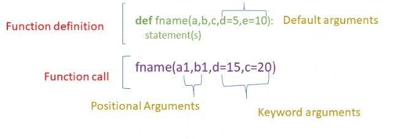

# This document covers important Python topics from beginner to advanced levels.

## Important topics

### Basic Functions

- Functions are the resuable block of code that allows us to encapsulate code in a callable block of code.
- Functions can be used multiple times simply by calling the function.
- A function can be defined using `def` keyword followed by the function name and the parenthesis containing parameters.
    ```py
        def function_name(params):{}

        # ~Note:~ `def` keyword tells the python compiler that this  line is creating a new function.
    ```
- A function can be called by using their name and passing arguments if there is any inside the parameters.
    ```py
        function_name(arguments)

        # ~Note:~ arguments are also known as actual parameters.
    ```
- A function can return a value using `return` keyword.
- The different types of arguments that can be passed in the functions are:
    - default arguments:
        - default arguments are the values that are provided while defining a functions.
        - An `=` operator is used to assign the default value to the argument.
        - The default value of an argument can be overridden if we pass the value to that parameter during the function call.
        - A function can have many default arguments, The default value should follow the non-default arguments.
    - keyword arguments:
        - Functions can also be called using keyword arguments of the form `kwarg=value`.
        - If we don't want to follow the order of the parameters in the function definition while passing an argument then this can be achieved using keyword argument.
        - The keyword argument should match the parameters in the function definition.
    - positional arguments:
        - Positional arguments are passed to the function call should be in the order of the parameters in the function definition.
    - Difference between `positional` vs `keyword` vs `default`
        
        - Important points to remember:
            - `default argument` should follow `non-default argument`.
            - `keyword argument` should follow `non-keyword argument`.
            - All the `keyword argument` should match the one of the parameter accepted by the function and their order doesn't matter.
            - Arguments should not be assigned with the multiple value.
            - `default arguments` are optional, we can pass if we want to override the value.
    - Variable length arguments: Variable length arguments are also known as arbitrary arguments. The arbitrary argument are useful in the situation where we don't know the number of arguments required in advance.
        - arbitrary positional arguments:
            - The `arbitrary positional` arguments is represented by `*args`.
            - The * before the parameter name allows the function to accept any number of positional arguments, which will be wrapped up into tuple.
            - Any name can be choosen for parameter it no need to `args` untill and unless it follows *.
            - Syntax:
                ```py
                    def function_name(*args):
                        # some lines of code

                    function_name(1,2,3,4) #arguments that are passed as tuples into the function
                ``` 
        - arbitrary keyword arguments
            - The `arbitrary keyword` arguments is represented by `**kwargs`.
            - The ** before the parameter name allows the function to take any number of keyword arguments, which will be wrapped up into dictionary.
            - Any name can be choosen for parameter it no need to `kwargs` untill and unless it is followed by **.
            - Syntax:
                ```py
                    def function_name(**kwargs):
                        # some lines of code
                    
                    function_name(s1=1,s2=2,s3=3,s4=4) # arguments that are passed as a dictionary into the function
                ```
- return values:
    - To return a value from the function we use `return()` method
    - The statements after the return are not executed, and they cannot be used outside the function.
    - If the return statment doesn't have any expression then NONE value is returned.
    - Multiple values can be returned from the function simply by returning comma seperated values.

### Modules and Packages

#### Modules
- Modules are used to organize code in the managaeble, reusable components.
- The ways for defining a module in python are:
    - A module can be written in python itself
    - A module can be written in C and loaded dynamically at run-time like `re (regular expression)` module.
    - A built-in modules like `itertools`.
<!-- Note: focusing on the modules written in python only -->
- Creating a module:
    - A module is simple a file written that contains legitimate python code with a `.py` extension.
    - Defining functions, classes, variables is just any other python script no special syntax
- Importing a module in some other file:
    - We can import a module using `import` statement
    - To import specific attribute like function, classes, or variables from a module is `from module_name import attr1,attr2`.
    - Renaming a imported module can be done using `as` keyword.
- Module search path:
    - When trying to import module in python, the intrepreter looks for sequence of locations. This sequence of locations is know as module search path.
    - sys: it is a built-in module that contains parameter specific to the system i.e. it contains variables and methods that interact with the interpreter.
        - sys.path: It is a buil-in variable within the sys module that contains list of strings that specifies the search path/directories that the inrepreter will search in for the required module.
        - Initialization of sys.path: It can be done in three ways
            - DEFAULT: The python interpreter looks for a module within the current directory. To make the interpreter search in some other directory we simply need to change the current directory.
            - THROUGH ENVIRONMENT VARIABLES: Environment variables can be set to add additional directories to the search path. Multiple paths are seperated by `: (colon) in unix` and `, on the windows`.
            - APPENDING PATH: append() is a built-in function of sys module, that can be used with `path` variable to add specific path for the interpreter search. 
        - The first string in the sys.path is always `'' empty string` that indicates the interpreter to look in the current directory.
- dir()
    - It is a buil-in function in python which is used to list the names of the atrribute, method of an object. It returns a list of strings that contains attribute and methods name.
    - It is used by the python developers when we need to inspect the attribute, methods, modules, or class. It is particularly useful for debugging, exploring unfamiliar object or to understand the structure of a new library.
    - dir() is used in:
        - Interactive Python session (REPL or Jupyter notebooks)
        - Scripts and programms.
        - Documentation generation tools.
        - Situation where ispection of object needed.
    - Scenarios where dir() can be used:
        - Using with module: When used without arguments, dir() returns the list of names in the current local scope, else when module name is passed as an argument we get the list of all the attributes and methods in that module
        - Using with class: It lists all the class attributes and methods, including the inherited ones.
        - Using with instance: lists all the instance attributes and methods, including those that are inherited from the class.
- `__name__ ` variable in python:
    - The `__name__` variable is a special built-in variable that specifies how the module is being used. It can have two different values `__main__` or the module name where it has been imported.
    - It is used to execute the python code directly as well as imported as a module
- Reload a module:
    - Restart the interpreter
    - Use a function called reload() from importlib

#### Packages
- A package is a python way of organizing related modules into a directory hierarchy
- A package allows hierarchial structuring of the modules namespace using dot notation.
- Creating a package:
    - A package is essentially a directory containing an `__init.py__` file along with the other module files.
    - The `__init__.py` file can be empty but it signifies that the directory should be treated as a package.
- Importing from a package
    - modules can be imported from package using dot notation.
    - from <package_name> import <module_name>
- Using `__init__.py` file:
    - It is a special python file that is used to mark a directory as a pacakge. Without this file python doesn't recognize directory as a package and won't be able to import modules from that directory.
    - The `__all__` variable in a pacakage's `init.py` file contains the list of string that specifies which modules can be imported when `from <package_name> import *`  is used.
- Packages can contain sub packages, allowing deeper hierarchial structure.

### Exception handling
- Exception handling in python is a mechanism that allows us to handle the error that occurs during the execution of the program gracefully.
- Instead of program or the application getting crashed we can catch the error and decide how we need to manage.
- The key concepts of Exception handling are:
    - `try` and `except` block: The `try` block contains the code that might actually throw an error. If the error occurs it will execute `except` block, if no error occurs then it will skip the `except` block.
    - `else` block: The `else` block will be executed when there is no error or exception occured. It is an **optional** block and it is returned when we need to execute the block only when try block completely executes successfully. It is useful to seperate successful code from error handling.
    - `finally` block: This block will be always executed, it doesn't matter whether the exception occured or not. It is used for cleanup purpose such as closing files or releasing resources.
    - `raise` keyword: This keyword is used to raise an exception intentionnaly/manually when a specific condition is met in the code. This helps us to add certain constraints to the functionality.  It is optional.
        ```py
            raise ExceptionType("Optional error message")
        ```
    - General syntax of exception handling:
        ```py
            try:
            # Code that might raise an exception
                risky_code()
            except SomeExceptionType (): # SomeExceptionType = ValueError or ZeroDivisionError or etc.,
            # Code that handles the exception 
                handle_exception()
            else:
                # Code that runs if no exception occurs
                code_if_no_exception()
            finally:
                # Code that runs no matter what
                always_execute()
        ```

### Lists and Tuples

#### Lists
- The lists in python is an 
    - Ordered: The elements have a defined sequence and we can access them using index.
    - Mutable: Elements can be add, remove, or modified to the lists.
    - Dynamic: List can dynamically grow or shrink.
    - It is a collection of different data types elements such as integers, string or even other lists.
- Memory Management:
    - Python lists are implemented as dynamic arrays. A dynamic array is similar to regular array but with the ability to rezise itself when more elements are added.
    - Initially, when python creates a lists it creates a contigous block of memory with more than it is necessary. If lists grows beyond its initial memory, the python will automatically creates a large block of memory and copies everything to this block. This resizing process makes the python lists dynamic.
    - Python allows over allocation of memory than required hence it can accomodate additional elements without resizing.
    - In python lists:
        - Lists doesn't store the actual values directly within the lists instead it stores the references to the locations in the memory where these objects are stored.
        - Why use reference? It helps the lists to store the different types of objects in a single list.
        - Python doesn't need to know the size and type of the list elements making lists highly flexible.
        - Each reference in the lists take up a fixed amount of memory. In a 64-bit system, The reference typically requires 8byte.
- List Operations/Methods:

    | **Operation/Method**                                                    | **Description**                                                                                                  |
    |-------------------------------------------------------------------------|------------------------------------------------------------------------------------------------------------------|
    | *Creating an empty list: `[]`*                                       | Initializes an empty list.                                                                                       |
    | *Accessing elements by index: `list_name[index_number]`*              | Accesses an element at a specific index.                                                                         |
    | *Accessing elements by slicing: `list_name[start_index:end_index]`*   | Accesses a range of elements from `start_index` to `end_index - 1`.                                               |
    | *Length of the list: `len(list_name)`*                                | Returns the number of elements in the list.                                                                      |
    | *Checking membership: `'element' in list_name`*                       | Checks if an element is present in the list.                                                                     |
    | *Count occurrences: `list_name.count(element)`*                       | Counts the number of times an element appears in the list.                                                       |
    | *First occurrence index: `list_name.index(element, start, end)`*      | Finds the index of the first occurrence of an element. Optional `start` and `end` specify a subrange.            |
    | *Sort: `list_name.sort()`*                                            | Sorts the list in ascending order.                                                                               |
    | *Reverse sort: `list_name.sort(reverse=True)`*                        | Sorts the list in descending order.                                                                              |
    | *Reverse: `list_name.reverse()`*                                      | Reverses the order of elements in the list.                                                                      |
    | *Shallow copy (method 1): `new_list = old_list.copy()`*               | Creates a shallow copy of the list using the `copy()` method.                                                    |
    | *Shallow copy (method 2): `new_list = old_list[:]`*                   | Creates a shallow copy of the list using slicing.                                                                |
    | *Deep copy: `copy.deepcopy(old_list)`*                                | Creates a deep copy of the list, copying all objects recursively.                                                |
    | *Total of elements: `sum(list_name)`*                                 | Returns the sum of all elements in the list.                                                                     |
    | *Smallest value: `min(list_name)`*                                    | Returns the smallest value in the list.                                                                          |
    | *Largest value: `max(list_name)`*                                     | Returns the largest value in the list.                                                                           |
    | *List to string: `separator.join(list_name)`*                         | Joins elements of the list into a string, using a separator.                                                     |
    | *String to list: `string.split('separator')`*                         | Splits a string into a list using a separator.                                                                   |
    | *Appending an element: `append(x)`*                                   | Adds an element `x` to the end of the list.                                                                      |
    | *Extending the list: `extend(iterable)`*                              | Extends the list by appending elements from the iterable.                                                        |
    | *Inserting an element: `insert(i, x)`*                                | Inserts an element `x` at the specified index `i`.                                                               |
    | *Removing an element: `remove(x)`*                                    | Removes the first occurrence of element `x`.                                                                     |
    | *Popping an element: `pop([i])`*                                      | Removes and returns the element at index `i`. If `i` is not provided, removes and returns the last element.      |
    | *Clearing the list: `clear()`*                                        | Removes all elements from the list, leaving it empty.                                                            |

#### Tuples
- Tuples in python are
    - Immutable: Once created they cannot be modified, added or deleted.
    - They are created by having comma seperated values inside `()`.
- Since they are immutable they can be used as a key in `dictionary` and elements in `set`.
- Accessing elements in tuples are faster than accessing elements in the list.
- Due to their immutability tuples may be cached internally by python to improve performance.
- Tuples are more memory efficient than lists and the memory overhead is also less since they doesn't change after the creation.
- Tuples are used when: 
    - Data integrity need to be maintained ie. when we need to ensure that the values should not be altered.
    - As dictionary keys
    - Fixed collection of values (Eg:(R,G,B))

### Dictionaries and Sets

#### Dictionaries
- The dictionaries in python are unordered, mutable collection that maps keys to value. They are also known as hashmap and associative array in other languages.
- Dictionaries are represented by `{}`.
- Dictionary can be created using {} or dict().
- Dictionary element can be accessed using `key` or `get()`.
    - using key: It throws KeyError if the key doesn't exists in the dictionary.
    - using get(): It allows us to specify default value for the key, It returns the default value if key doesn't exists in the dictionary.
- Keys in dictionary should always be unique if we try to create a new key-value pair with the existing key name then it overwrites the value with new one.
- Deleting an element in the dictionary can be done in three ways:
    - del: 
        - Remove a key-value pair by its key.
        - The syntax is `del dict_name[key_name]`
        - It doesn't return the removed value, it simply deletes the key-value pair.
        - It raises a KeyError if the key doesn't exists in the dictionary.
        - `del` should be used when we simply needs to delete the key-value pair and doesn't care about the deleted value.
        - We can make use of `del` to delete entire dict.
    - pop():
        - Removes a key-value pair by its key.
        - The syntax is `popped_value = dict_name.pop(key_name, default_value)`.
        - It returns the removed value.
        - It raises a KeyError if the key doesn't exists in the dictionary but this can be avoided using default value.
        - `pop()` should be used when we want to delete a key-value pair and also we need to get the deleted value.
    - clear(): 
        - Deletes all the key-value pair emptying the dictionary.
        - The syntax is dict_name.clear()
- Modify and update values in dictionary can be done in several ways:
    - Direct assignement: We can update the values directly using key name.
    - update() method: It allows us toupdate multiple keys at a time and add new keys if they doesn't exists.
    - setdefault() method: If the key doesn't exists, it is used to insert a key with a default value. If it exists it returns the current value without modifying it.

- Dictionary methods:
    - `keys()` method: 
        - The keys() method returns a view object that displays a list of all the keys in the dictionary.
        - The view object returned by keys() is a dynamic view. It means it reflects the changes mad eto the dictionary. If we modify the dictionary after obtaing the view, the object will automatically reflects those changes.
    - `values()` method:
        - The values() method returns a view object that display the list of values in the dictionary.
        - Similar to keys() the view object of values() is also dynamic view.
    - `items()` method:
        - The item() method returns a view object that display the list of tuples, where each tuple is key-value pair of the dictionary.
        - The items() method is also a dynamic view.
- Existence of the key in the dictionary can be checked using `in` keyword. It returns boolean value.
- Dictionary comprehension:
    - It is concise way of creating a dictionary in python using single line of code.
    - It allows us to create a dictionary using other iterable data structure or existing dictionary.
    - The syntax for dictionary comprehension is `{key_expression: value_expression for item in iterable if condition}`
        - key_expression: The expression that generates the dictionary keys.
        - value_expression: The expression that generates the dictionary values.
        - iterable: A collection or sequence that the comprehension iterate over.
        - condition (optional): A filter that is used to specify to include only items that meets certain criteria.
- Default dict
    - `defaultdict` is a subclass of python built-in dict provided by the collections module.
    - It allows for an automatic assignment of values for the keys that doesn't exists in the dictionary.
    - `defaultdict` requires a factory function that provides a default value for the nonexistent keys.
    - `defaultdict.default_factory` returns the factory function used to generate a default values.
    - common factory funtion for `defaultdict` are:
        - int: returns default value of 0
        - list: returns default value of empty list [].
        - set: returns default value of empty set (). It is used when we need to maintain unique values for each key.
        - str: returns default value of empty str.
        - lambda: custom factory function can return any default value using lambda
        - dict: returns default value of empty dict {}. It is usefuls for creating nested dictionaries.
- OrderedDict():
    - Since dictionary is an unordered collection, we can maintain the order in which the keys are inserted using OrderedDict().
    - It provides additional method like move_to_end(key, last=True/False), it moves the key-value pair either to the end or the beginning.
    - The ordereddict objects comparission takes into account both the key-value pair and their order of insertion.

#### Sets
- A set is an unordered collection of unique elements. Sets are mutable which means it can be changed after the creation.
- But in the sets the elements stored should be immutable like numbers, strings or tuples.
- Set can be created using `{}` or `set() constructor`.
- The set operations are:
    - Adding an element: `add()`: It adds a single element into the set if the elements already exists then it remains unchanged.
    - Removing an element:
        - `remove()`: It removes a sepecified element in the set, if the element doesn't exists it raises `Keyerror`.
        - `discard()`: It is similar to remove but it doesn't raises KeyError if the element not found.
        - `clear()`: It removes all the elements from the set resulting in the empty set.
        - `pop()`: It removes and returns arbitrary element(different element every time). It raises KeyError if the set is empty.
    - Update: `update()`: It is used to combine two sets. It adds the element from the iterable to the current set.
    - Copy: `copy()`: It returns a shallow copy of the set. 
    - Length: `len()`: It returns the number of element in the set.
    - Check membership: `in`: It checks if the elements is present if it present it returns `True` else returns `False`.
    - Union: `|` or `union()`: It combines two sets, Duplicate elements are removed. It returns a new set.
    - Intersection: `&` or `intersection()`: It returns a set which are present in both the sets.
    - Difference: `-` or `diiference()`: It returns a set that are in the first set but not in the second set.
    - Symmetric difference: `^` or `symmetric_difference()`: It returns a set that contains in either of them but not in both.
    - Subset:
        - `issubset()`: It returns true if all the elements of set1 present in set2.
        - `<`: It is used to check if one set is proper set of another. It means every element in setA present in setB but setB has atleast one element more than that of setB.
        - `<=`: It is used to check if a set is subset of another and possibility of being equal.
- Set comprehension:
    - Set comprhension provides a concise way of creating set using single line of code.
    - It allows us to create set using other iterables.
    - The syntax for set comprehension is: `{expression for item in iterable if condition}`
        - expression: The value or the tranformation to be included in the set.
        - item: A variable representing each element in an iterable.
        - iterable: A collection of elements
        - condition(optional): A filter that determine whether to include an element or not.
- Frozen sets:
    - Frozen sets are the immutable version of the set. It cannot be changed once they are created.
    - This feature allows frozen sets hashable allowing them to be used as keys in the dictionaries.
    - Frozen sets are created using `frozenset()`.
    - Frozen set supports set operation but the result will always be a new set.

### Iterate over list
  
  - ***using for loop:***
    - In python there is no C style 'for' loop, i.e., `for(int i=0;i<n;i++)`
    - Python for loop is used for sequential traversal, to iterate over an iterable like string, tuple, list, set, or dictionary
    - Syntax:
        ```py
            for var in iterable:
                statement 1
                statement 2
                .
                .
                statement n
        ```
  - ***Using for loop and range():***
    - The range() function return sequence of numbers in a given range.
    - Syntax:
        ```py
            '''
            Syntax for: range(start, stop, step):
                1. start [optional]: start value of the sequence
                2. stop: next value after the end value of the sequence
                3. step [optional]: denoting the difference between any two numbers in a sequence
            '''
            for i in range(number):
                statement 1
                statement 2
                .
                .
                statement n
        ```
  - ***Using for loop with zip():***
    - The zip() function is used to iterate over two lists in parallel.
    - Syntax:
        ```py
            for array1_item, array2_item in zip(array1, array2):
                statement 1
                statement 2
                .
                .
                statement n
        ```
  - ***Using nested for loops:***
    - Syntax:
        ```py
            for var1 in sequence1:
                for var2 in sequence2:
                    statement 1
                    statement 2
                    .
                    .
                    statement n
                statement 1
                .
                .
                statement n
        ```
  - ***Using enumerate() method:***
    - The enumerate() method adds a counter to an iterable and returns it in the form of an enumerating object.
    - The enumerated object can then be directly used in 'for loops' or convert it into list of tuples using list().
    - Syntax: 
        ```py
            enumerate(iterable, start = 0)
            '''
                iterable: any object that supports iteration
                start: the index value from which the counter is to be started, by default it is 0
            '''
        ```
  - ***Using while loop:***
    - Python while loop is executed a block statement repeatedly until a given con dition is satisfied.
    - When the condition becomes false the line immediately after the while loop is executed.
    - While loop falls under the category of *indefinite iteration*, it means number of times the loops should be executed is not specified explicitly.
    - While loop is used when the number of itereation is unknown or else for loop should be used.
    - Syntax:
        ```py
            while expression:
                statement 1
                statement 2
                .
                .
                statement n
        ```
  - ***Using list comprehension:***
    - List comprehension consists of bracket containing the expression.
    - It will translate traditional iterating approach to simpler expression.
    - Syntax:
        ```py
            newList = [expression(element) for element in oldList if condition]
        ```
  - ***Using the map() function:***
    - Map() function is used to get the map object as a result of applying the function to each item of a given iterable.
    - The map object can be converted to a list using list() method.
    - Syntax:
        ```py
            map(function, iterable)
            '''
                function: it is a function to which the map passes each element of the given iterable.
                iterable: such as list, tuple, dict, etc.
                
                imp: check the example below
            '''
            # Return double of n
            def addition(n):
                return n + n
            
            # We double all numbers using map()
            numbers = (1, 2, 3, 4)
            result = map(addition, numbers)
            print(list(result)) #returns [2, 4, 6, 8]
        ```
