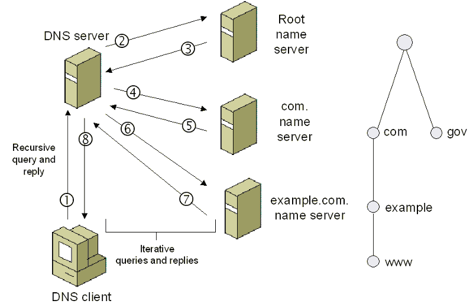

# This document serves as a comprehensive guide to essential web technologies, offering a foundational understanding for developers

## WWW - World Wide Web
- It is often referred as Web.
- It is a system of interconnected webpages written in hypertext via the internet.
- The key components of WWW are:
    - Hypertext: 
        - The web is based on the concept of Hypertext, which allows user to navigate between the documents(web pages) using hyper links. 
        - Hyper Text Markup Language is the standard used for creating the webpages.
    - Uniform Resource Locator (URL): 
        - URL is the unique address of a website on the web.
        -  The URL is composed of different parts:
            - 
    - Web Browser:
        - It is a software application used to access and view web pages.
        - web browsers play a crucial role in rendering web pages by interpreting and processing HTML for structure, CSS for styling, and JavaScript for interactivity, providing users with a rich and dynamic browsing experience.
    - Web Server:
        - It is a computer system that stores the web pages and deliver them to web browser upon request.
        - Examples of web server are Apache, Nginx etc.,
    - Web protocol:
        - The widely used protocols to create communication between clients(such as web browser) and server.
            - HTTP: Hyper Text Transfer Protocol
            - HTTPS: Hyper Text Transfer Protocol Secure
            - SMTP: Sinple Mail Transfer Protocol
            - FTP: File Transfer Protocol
            - DNS: Domain Name System
            - IMAP
            - POP3
    - Web Standard:
        - The web is built on open standards devloped by W3C (Worl Wide Web consortium) and other organization.
        - These standards ensure interoperability and accessibility of web content across different web browser.
    - Web Development
        - Web development involves creating and maintaining websites and web applications.
        - It includes tasks such as designing web pages, writing HTML, CSS, and JavaScript code, and optimizing websites for performance and accessibility.

## Understanding in and out of the web!!

### How the web works?

### Parts of the Web: 
- Before we start understanding how the web works we need to understand the different parts of the web.
- Client:
    - The application which runs on our system and connected to the internet
    - Chrome, firefox etc., are the example of client.
    - Since browser runs on our system we can think our computer as a client in the client-server model.
    - Every client computer has an unique IP address which used by other computers to identify
- Server:
    - It is a system that stores the web pages and deliver them to the client computer upon request.
    - The server is also connected to the internet and has an unique IP address.
    - The server has a special software installed and running which tells how to respond to incoming requests from the client computer or the browser.
- IP address:
    - IP address stands for Internet Protocol address.
    - It is a numerical identifier for a computer,router,server etc over the TCP/IP network.
    - Every computer on the internet has unique IP address that is used to identify and communicate with the other computer.
    - The IP address has 4 sets of numbers seperated by decimal point and it is called as logical address (224.43.56.54).
    - The logical address is converted to Physical address by TCP/IP software.
- ISP:
    - ISP stand for Internet Service provider.
    - ISP is the middle man between the client and the server.
    - When client hit a request/url, the browser doesn't know where to go, here ISP comes in picture.
    - The ISP performs a DNS (Domain Name System) lookup to resolve the domain name of the site requested by the client to its corresponding IP address.
- Domain name System (DNS):
    - The distributed database which keeps track of computers domain name and their corresponding IP address on the internet.
- Domain name:
    - Users use the domain name (e.g. www.github.com) to get to a website on the internet.
    - The DNS uses it to look up the corresponding IP address for that given website.
- TCP/IP:
    - It stands for Transmission Control Protocol/Internet Protocol.
    - A protocol is simply a standard set of rules for doing something.
    - The TCP/IP is used as standard for transferring data over the network.
- Port:
    - It is always associated with the IP address.
    - It is helpful to identify specific process on a server.
- Host:
- Protocol:
- URL

**Behind the Scene**
- 
- Client type the URL in the browser : `https://www.github.com/`
- The browser parses the information contained inb the URL:
    - protocol: `https`
    - domain name: `github.com`
    - resource: `/` (anything comes after`.com/`)
- The browser communicates with the ISP(Internet Service Provider) to perform DNS lookup of the IP address of the web server that hosts `https://www.github.com`.
    - The DNS service first contact the Root name server.
    - The Root name server doesn't know the IP address of `https://www.githu.com` but knows where to find `.com` a top level domain and returns the IP address of `.com`.
    - Then the service searches `.com` server for the IP address of `www.github.com` but it doesn't instead it knows where to find `github.com` part and returns the IP address of it.
    - Then the service searches `github.com` for the IP address of `www.github.com` returns the IP address.
    - Once the ISP recieve the IP address of the destination server, it sends it to the web browser. Lets take the return IP address be `https://192.30.253.45:443`
        - The browser takes the IP address `192.30.253.45`, port number `443` from the returned URL and opens a TCP/IP socket connection and finally web browser and web server are connected.
    - The client or the web browser sends an HTTPS request for the server rquesting the main HTML page of www.github.com 
    - The webserver receives the request and looks for the HTML page if the page exists the web server send the response back or else it will send HTTP 404 error message (Page not found).
    Then the browser creates a DOM structure for the recieved HTML page and renders it.

  
<b>Client-Server Model & Scale a Simple Web Application</b>

**Client-Server model**
- The client server model describes the communication between two computing entities over a network.
- Client are the ones requesting resource or the service by making a request through URL.
- Servers are the one that stores the web pages and delivers them to client when they are requested.
- The client-server can be classified into following categories:
    - 1-tier architecture:
        - In 1-tier architecture the database is directly available to the user, i.e., the client, server and database all available in a same machine.
        - User request don't manage any network protocols.
    - 2-tier architecture:
        - The 2-tier architecture is similar to the basic client-server model.
        - The application at the client end directly communicates with the database at the server side. 
        - APIs like ODBC and JDBC are responsible for the interaction
        - The application on the client side establishes a connection with the server side to communicate with the DBMS.
    - 3-tier architecture
        - In 3-tier architecture there is another layer in between the client and the server.
        - The client does not directly communicates with the server database.
        - Instead it communicates with the application server which in turn communicates with the database system. 
    - n-tier architecture

**How to scale a web application**

- A single server don't have power to handle the thpousands or millions of requests coomming from multiple visitors.
- Application scalling involves optimizing the apps architecture, infrastructure and resource. It aims at handling the increased loads without comprimising the user experience or performance.
- The problems with the scalibility of the web applications are:
    - Database inefficiency: 
        - a robust *(ablility to handle large volume of data without degrading in the performance)* and resistant *(able to recover from hardware failure, data corruption etc)* database required while scalling a web app.
        - If we choose a wrong database we may face an issue while scalling a web app.
        - The most reliable solution is using replication and sharding methods.
        - replication: Replication involves creating and maintaining copies  of the data on multiple server and ensuring data is handled on multiple server simultaneously. Replication is done for read purpose.
        - sharding: Sharding involves partitioning of data into smaller chunks and distributing this data across multiple servers. Sharding is done to improve the write scalability.
    - Server Issues:
        - It happens due to the increase in RPM (Request per Minute) and the connected users.
        - The server issue can be solved using vertical or horizontal scaling or both methods.
    - Code failures
    - Lack of automation
    - Poor traffic distribution:
        - Inefficient server management often trafic distribution and balance problem
- The most efficient and popular ways to improve application scalability are:
    - cloud computing
    - vertical scaling:
        - Vertical scaling aims to increase/upgrade the RPM and CPU metrics in the existing server.
        - Vertical scalling is a temporary solution we should not comnpletely rely on that.
    - horizontal scaling:
        - Horizontal scaling involves adding more instance of the server to distribute the load.
        - Load balancer can be used to distribute the traffic evenly amongst the instances.

**How Load balancer works**
- Consider we have multiple server having its own IP address and we need to distribute the traffic amongst the backend server this can be done by using Load balancer.
- The load balancer acts as a traffic cop in the web that routes the clients request across the server in a more efficient and fastest manner possible.
- when we have multiple server instance we cannot broadcast all the IP address, so we create a virtual IP address which we publicly broadcast to the client.
- The virtual IP address points to the Load balancer.
- So when there is a DNS lookup for the site it will point to the virtual IP address of the load balancer.
- Then the load balancer distributes the traffic to various server in real time.
- The load balancer figures out which traffic needs to send to which server using a algorithms, one of the popular algorithm called Round Robin.
- We choose round robin if all the server have same configuration in terms of processing speed and memory.
- With another algorithm, Least Connections, the next request is sent to the server with the least number of active connections.

  
<b>HTTP</b>

**Understanding HTTP**
- In client-server model, clients and server exchange message in a request-response manner.
- Client sends a request and server response.
- In order for this to carry on the client-server must follow certain rules and this protocol is known as HTTP.
- The HTTP defines:
    - Syntax: the data format and encoding
    - semantics: the meaning associated with the syntax
    - timing: speed and sequencing
- Each HTTP request and response exchanged between client and server is considered as a single HTTP transaction.
- HTTP is a text based and each message contains header and the body.
- HTTP is an application layer protocol (just standardizes hosts communication), it does not transmit data it still needs to depend on TCP/IP protocol to get the request and response from one machine to another.
- HTTPS is sort of similar to HTTP but with a slight difference.
- HTTP request or response is not encrypted and it is vunerable to attacks, whereas HTTPS more secure connection that uses encryption to keep things safe.
- It stands for HTTP over TLS/SSL.
- SSL is a security protocol that allows the client and server to communicate across a network in a secure way.
- The client typically indicates whether it needs a TLS/SSL connection by using a special port number: 443 or else the port number:80 for HTTP.

**HTTP Methods**
- HTTP defines a set of request methods that define what action needs to be performed when the request is made.
- The different HTTP methods are:
    - GET: It should only retrive data.
    - POST: It is used to submit an entity to the specified resource, it means it creates a new entity.
    - PUT: This method is used to update the data, it replaces/rewrite all the current representation of the target resource.
    - PATCH: This method is used to apply partial modification to the resource.
    - DELETE: This method deletes the specified resource.
    - HEAD: It is similar to GET, It should only retrieve data without the response body.

